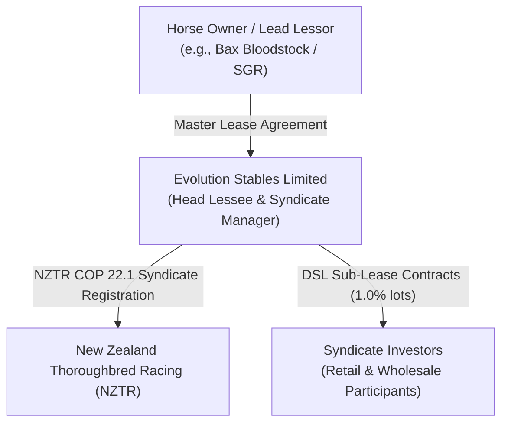
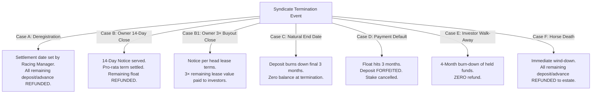

# Evolution Stables — Operations SOP (Standard Operating Procedures)

> **Document Class:** Internal Standard Operating Procedures (SOP) & Operator Playbook  
> **Jurisdiction:** New Zealand (NZTR Code of Practice Rule 22.1 / Bloodstock Syndication)  
> **Status:** Authoritative / Canonical Single Source of Truth (SSOT)  
> **Last Updated:** August 2026

---

## Table of Contents
1. [Executive Overview & Product Philosophy](#1-executive-overview--product-philosophy)
2. [The Digitally Syndicated Lease (DSL) Construct](#2-the-digitally-syndicated-lease-dsl-construct)
3. [The Commercial & Pricing Mathematical Engine](#3-the-commercial--pricing-mathematical-engine)
4. [The 5 / 4 / 3 Subscription Float Ledger & Billing Lifecycle](#4-the-5--4--3-subscription-float-ledger--billing-lifecycle)
5. [Prize Money Distribution & Full-Transparency Payouts](#5-prize-money-distribution--full-transparency-payouts)
6. [Equine Welfare, Racing Authority & Veterinary Governance](#6-equine-welfare-racing-authority--veterinary-governance)
7. [Syndicate Termination Protocols & Close Triggers (Cases A–F)](#7-syndicate-termination-protocols--close-triggers-cases-af)
8. [NZTR Regulatory Compliance, Governance & Dispute Escalation](#8-nztr-regulatory-compliance-governance--dispute-escalation)
9. [Secondary Transfers & Investor Onboarding Standards](#9-secondary-transfers--investor-onboarding-standards)
10. [Tax Governance, GST Treatment & Investor Tax Disclaimer](#10-tax-governance-gst-treatment--investor-tax-disclaimer)
11. [Summary Reference Table for Operations Desk](#11-summary-reference-table-for-operations-desk)

---

## 1. Executive Overview & Product Philosophy

### 1.1 Who We Are
**Evolution Stables Limited** is an Authorised Syndicator operating under the governance of **New Zealand Thoroughbred Racing (NZTR)**. We bridge institutional thoroughbred racing and modern retail ownership by fractionalising premium racehorse leases into simple, fixed-term, digitally managed interests called **Digitally Syndicated Leases (DSLs)**.

### 1.2 The Core Problem in Traditional Syndication
Historically, racehorse ownership has been plagued by friction:
* **The "Cash Call" Fear:** Traditional syndicates bill investors unpredictably for vet bills, spelling, nomination fees, and surgery. One bad month can lead to an unexpected $500–$1,000 capital call.
* **Confusing Multi-Party Accounting:** Investors struggle to reconcile trainer invoices, agistment fees, and racing club deductions against confusing syndicate spreadsheets.
* **Micro-Dust Slop:** Platforms selling 0.002% micro-shares dilute the emotional connection and create administrative nightmares.

### 1.3 The Evolution Stables Value Proposition: Fixed Price, Fixed Term, Fixed Return
Evolution Stables removes all financial friction through four immutable consumer guarantees:
1. **Fixed Monthly Cost (GST-Inclusive):** The monthly lease rate ($M$) is **100% all-inclusive and GST-inclusive**. Investors will **never receive a cash call or surprise invoice**. All training, routine veterinary care, agistment, nomination fees, Stripe processing, and GST are bundled into the single price.
2. **Fixed Duration:** Every syndicate operates for a defined fixed calendar term (typically 12 to 24 months). There is no indefinite lock-in.
3. **Transparent Fixed Return:** Prize money distributions follow a public, verifiable formula based directly on official NZTR results published on *Loveracing.nz*. What the horse wins is transparently calculated and paid out on schedule.
4. **Meaningful Ownership Stakes:** Minimum investments start at **1.0%** (with **0.5%** step increments), giving participants a meaningful ownership stake via the leasing model in their horse's racing journey without micro-share dilution.

---

## 2. The Digitally Syndicated Lease (DSL) Construct



### 2.1 Legal Definition
A **Digitally Syndicated Lease (DSL)** is a fixed-term, fractional sub-lease interest in an underlying thoroughbred racehorse. It is a pure leasehold interest governed by New Zealand contract law and the NZTR Bloodstock Syndication Code of Practice. It is **not** equity in a corporate entity, not a cryptocurrency/token, and confers no residual capital ownership in the physical horse upon lease expiry.

### 2.2 Strict Separation of Managerial Roles
* **The Syndicate Manager:** **Evolution Stables Limited**. Evolution is responsible for investor onboarding, AML/KYC compliance, monthly subscription billing, financial accounting, investor reporting, and prize money distributions.
* **The Racing Manager:** The appointed racing authority (typically the Trainer or Lead Lessor). Under NZTR rules, there can only be **one Racing Manager** per horse. The Racing Manager makes all decisions regarding race nominations, race-day tactics, trackwork, and training facilities.

---

## 3. The Commercial & Pricing Mathematical Engine

```
       [Owner Net Cost / 1% / month]  (e.g., $70.00)
                     │
                     ▼
          + 5.0% Evolution Margin
          + 3.0% Payment Processing Buffer
                     │
                     ▼
          [List Price per 1% / month]  (e.g., $76.00)  ◄── Round UP to whole NZD
                     │
                     ▼
       [Monthly Investor Rate (M)] = List Price × Stake%
```

### 3.1 Rate Calculation Formulas
The pricing engine accepts the baseline wholesale cost charged by the horse owner/trainer and automatically computes the investor rate:

$$\text{list} = \lceil \text{cost} \times (1 + \text{fee}_{\text{evo}}) \times (1 + \text{fee}_{\text{proc}}) \rceil$$

$$\text{M} = \lceil \text{list} \times \text{stake}\% \rceil$$

* $\text{cost}$: Owner's net monthly lease and keep fee per 1% share (e.g., $\$70.00$).
* $\text{fee}_{\text{evo}}$: Evolution Stables management fee (default **5.0%**, configurable per campaign).
* $\text{fee}_{\text{proc}}$: Stripe and payment processing buffer (default **3.0%**, configurable per campaign).
* $\lceil \dots \rceil$: Mathematical ceiling function (always round UP to the nearest whole NZD).

### 3.2 Live Worked Example (Nellie / Lady Ketchikan)
* **Wholesale Owner Cost:** $\$70.00$ / month per 1%
* **List Price Calculation:** $\$70.00 \times 1.05 \times 1.03 = \$75.705 \rightarrow \mathbf{\$76.00}$ per 1% / month.
* **Investor Buys 1.0% Stake:** $\text{M} = \$76 \times 1.0 = \mathbf{\$76.00 / \text{month}}$.
* **Investor Buys 2.5% Stake:** $\text{M} = \$76 \times 2.5 = \mathbf{\$190.00 / \text{month}}$.

---

## 4. The 5 / 4 / 3 Subscription Float Ledger & Billing Lifecycle

To protect horse owners from unpaid training bills and prevent syndicate defaults, Evolution operates an institutional **Subscription Float Ledger**.

```
[DAY 1: CHECKOUT] ──► Pays 5 × M (3 Months Deposit + 2 Months Advance) ──► Float Level = 5
                              │
                              ▼
[MONTHLY CYCLE]  ──► 1st of Month: Float drops 5 ➔ 4. Card billed M. Float returns to 5.
                              │
                    ┌─────────┴─────────┐
                    ▼                   ▼
             [Payment OK]        [Payment Fails]
                    │                   │
              Float stays 5       Float burns 4 ➔ 3 (Default Notice Sent)
                                        │
                                  ┌─────┴────────────────┐
                                  ▼                      ▼
                            [Topped Up]            [Hits 3 Months Unpaid]
                                  │                      │
                           Restored to 5          Deposit Forfeited
                                                  Stake Liquidated
```

### 4.1 Checkout Composition ($5\times\text{M}$)
Upon joining, every investor pays exactly **$5\times\text{M}$**:
* **3 Months Security Deposit:** Held in the horse ledger to cover the final wind-down term or protect against default.
* **2 Months Advance Keep:** Consisting of 1 month current advance + 1 month prepaid forward.

### 4.2 The Monthly Billing Cadence
1. Billing operates strictly on a **calendar month basis** (1st to last day of the month).
2. On the 1st of each month, the active prepaid month is consumed, dropping the investor's ledger from **5 months to 4 months**.
3. Stripe automatically bills the card for **$M$**, returning the ledger balance to **5 months**.

### 4.3 Default & Forfeiture Sequence (The 4 $\rightarrow$ 3 Rule)
* **Stage 1 (Notice Period):** If a monthly payment fails on the 1st, the ledger balance burns downward from **4 months toward 3 months**. The investor enters formal **Default Status**. Automated reminders are dispatched.
* **Stage 2 (Prize Freeze):** While in default, all prize money distributions attributable to the stake are **frozen and held** by Evolution Stables.
* **Stage 3 (Cure):** If the investor pays the arrears before hitting the 3-month mark, their account is restored to Good Standing and their float tops back to 5.
* **Stage 4 (Forfeiture at 3 Months):** If the balance reaches the 3-month deposit boundary without payment:
  1. The lease agreement is terminated immediately.
  2. The 3-month deposit is **forfeited to Evolution Stables** to settle ongoing contractual commitments with the horse owner.
  3. Ownership and leasehold rights are revoked and reallocated.

### 4.4 Natural DSL Expiry
When a syndicate reaches its scheduled end date, billing stops **3 months prior to completion**. The 3-month security deposit is burned down to zero to fund the remaining 3 months of training, leaving a $0.00 balance upon lease closure.

---

## 5. Prize Money Distribution & Full-Transparency Payouts

### 5.1 The Transparency Model
Evolution Stables operates on total accounting clarity. Investors do not need to decipher hidden deductions:
* **The Public Source:** Official Gross Stakes won are published directly by NZTR on *Loveracing.nz*.
* **The Eligible Pool:** Official gross prize money won across all race starts during the period.

### 5.2 The 75 / 25 Distribution Formula
Evolution Stables syndicate distributions are calculated at **75% of eligible gross stakes won**, distributed pro-rata based on leasehold holdings. **25% is retained by the owner covering race-day expenses (including jockey, trainer, and nomination fees)—underpinning our fixed-cost model protecting investors from capital calls.**

$$\text{Investor Payout} = \text{Eligible Gross Stakes} \times 75\% \times \text{Stake}\%$$

| Component | Share | Purpose |
| :--- | :--- | :--- |
| **Investor Syndicate Pool** | **75.0%** (default) | Distributed pro-rata based on leasehold holdings directly into verified bank accounts. |
| **Retained by Owner** | **25.0%** | Retained by the owner covering race-day expenses (including jockey, trainer, and nomination fees) — underpinning our fixed-cost model protecting investors from capital calls. |

> **The Public Transparency Mechanism:** In New Zealand racing, NZTR automatically deducts ~15% to 18% at source for jockeys and trainers. The remaining buffer retained by the owner absorbs race nomination fees and race-day incidentals. **This ensures investors receive their clean 75% share of official gross stakes won without ever being asked for additional funds.**

### 5.3 Distribution Cadence & Carry-Forward Rule
* **Cadence:** Distributions and detailed financial summaries are issued **quarterly** (Q1, Q2, Q3, Q4).
* **Cut-Off / Carry-Forward Rule:** Stakes won in the final calendar month of a quarter (e.g., late June) whose funds have not yet cleared from NZTR are carried forward to the following quarter's distribution statement.

### 5.4 The 2-Month Paid-Up Qualification Rule for Race Returns
* **The Qualification Rule:** An investor must have been an active, paid-up syndicate member for **at least two (2) full consecutive calendar months** prior to the race date to be eligible for prize money returns generated from that race.
* **Rationale:** This protects existing syndicate members by preventing speculative buyers from purchasing a stake immediately prior to a major group or feature race to capture prize money without contributing to the horse's preparation. Prize money won during an un-qualified period remains in the syndicate reserve fund or is distributed exclusively to established, qualified leaseholders.

---

## 6. Equine Welfare, Racing Authority & Veterinary Governance

### 6.1 Absolute Welfare Supremacy (SA Clause 6)
Equine welfare is the non-negotiable foundation of Evolution Stables:
* **Trainer Authority:** The licensed Trainer and Racing Manager hold **sole, final, and absolute discretion** regarding the horse’s training regime, race nominations, trackwork, spelling, and veterinary treatments.
* **Zero Interference:** Neither Evolution Stables nor any syndicate investor has the power to instruct, override, or pressure the Trainer on equine welfare matters.

### 6.2 Veterinary Listing Certification
To prevent burdensome compliance overhead, standalone external veterinary inspection certificates are not appended to the PDS. Instead:
* The Trainer and Lead Lessor formally certify that the horse is in active training and sound health upon listing.
* All ongoing medical treatments must be administered by NZTR-licensed veterinarians in compliance with the NZTR Rules of Racing.

---

## 7. Syndicate Termination Protocols & Close Triggers (Cases A–F)

When a syndicate ends, the float ledger is reconciled according to strict, predefined rules:



### 7.1 Detailed Close Case Specifications

| Case | Trigger Event | Operational Procedure & Settlement | Investor Financial Outcome |
| :--- | :--- | :--- | :--- |
| **Case A: Deregistration** | Horse retired from racing or deregistered by NZTR. | Settlement date is determined formally by the **Racing Manager**. Billing ceases on the official date. | **Full refund** of all remaining unused deposit and advance float. |
| **Case B: Owner 14-Day Close** | Lead Lessor exercises contractual right to terminate head lease (e.g., 14 days notice). | Evolution issues 14 days formal notice to syndicate members. Contract settles on the 14th day (pro-rata partial month supported). | **Full refund** of all unused advance keep and security deposit. |
| **Case B1: Owner 3× Buyout Close** | Lead Lessor exercises contractual right to terminate head lease **where head lease provides exit proceeds** (3× remaining lease value). | Evolution issues notice per head lease terms. 3× buyout calculated on remaining lease value. | **3× remaining lease value paid to investors** pro-rata. Unused advance/deposit also refunded. |
| **Case C: Contract End Date** | Syndicate reaches natural fixed expiry date. | Billing stops 3 months prior. The 3-month deposit funds the remaining lease duration. | Account settles to **$0.00 balance**. |
| **Case D: Payment Default** | Investor fails to cure default and float burns to 3 months. | Immediate lease cancellation. Stake repossessed by Evolution Stables. | **Deposit forfeited** to Evolution; arrears settled from deposit. |
| **Case E: Investor Walk-Away** | Investor voluntarily elects to exit prior to lease expiry. | Notice must be served prior to the 1st of the month. A **4-month float burn-down** is enforced. | **Zero refund**. Float funds the 4-month notice period. |
| **Case F: Horse Mortality** | Horse passes away or is humanely euthanised. | Syndicate winds down immediately upon official veterinary notification. | **Full refund** of all unused advance keep and deposit paid to the investor's estate. |

---

## 8. NZTR Regulatory Compliance, Governance & Dispute Escalation

### 8.1 Bloodstock Syndication Code of Practice (COP 22.1)
Evolution Stables is registered with and governed by New Zealand Thoroughbred Racing. All Syndicate Agreements are legally bound to the **NZTR Code of Practice Rule 22.1**.

### 8.2 Dispute Resolution Escalation Path
* **Step 1 (Internal Dialogue):** Any grievance or dispute must first be submitted in writing to the Syndicate Manager (Evolution Stables) at `alex@evolutionstables.nz`. The parties have 14 business days to resolve the issue in good faith.
* **Step 2 (NZTR Formal Escalation):** If unresolved, either party may formally escalate the dispute to the **NZTR Syndication Department** (`syndication@nzracing.co.nz`) for mediation and regulatory determination under the Rules of Racing.

### 8.3 Removal of Syndicate Manager
To guarantee investor protection under COP 22.1:
1. **By Investor Vote:** Syndicate members may remove Evolution Stables as Syndicate Manager via a **75% Special Resolution vote** of total syndicate shareholdings.
2. **By NZTR Board Order:** The NZTR Board may order the immediate removal of the Manager in the event of insolvency, material breach of the COP, or serious regulatory misconduct.

---

## 9. Secondary Transfers & Investor Onboarding Standards

### 9.1 AML / KYC Standards
Prior to executing any lease contract or receiving prize money distributions, all investors must complete identity verification in compliance with the **Anti-Money Laundering and Countering Financing of Terrorism Act 2009 (NZ)** and NZTR syndication standards. Verification is conducted digitally via Stripe Identity.

### 9.2 Secondary Trading & Private Transfer Protocol
* **Official Line:** *"Secondary market is coming, not ready yet. Peer-to-peer trading can occur, but has to be executed via Evolution. Standard platform fees apply."*
* **Evolution-Facilitated Private Transfers:** Investors wishing to exit or transfer their DSL stake prior to lease expiry (including transfers to friends/family) request a transfer facilitated directly by Evolution Stables.
* **Fee Structure:** Evolution Stables charges a **5.0% transfer fee + 3.0% processing fee (8% total) applied to both sides of the trade** (Buyer pays purchase price + 8%; Seller receives proceeds - 8%). This is a **change-of-owner fee**; the parties handle the purchase price payment between themselves unless they request Evolution to escrow the funds.
* **PDS & Syndicate Agreement Legal Framing:** The regulatory PDS and Syndicate Agreement disclose that *"transfers of ownership can be processed at the investor's request subject to administrative and processing fees"*, without hardcoding rigid percentage figures into the legal template.
* **Assignee Verification:** The incoming buyer must successfully complete Stripe Identity AML/KYC checks and execute the Syndicate Agreement before the transfer is legally recorded on the horse ledger.
* **Planned Platform Secondary Market:** A dedicated digital secondary marketplace is planned for the Evolution platform to enable peer-to-peer liquidity among verified investors (under active roadmap development; not active at initial launch).

---

## 10. Tax Governance, GST Treatment & Investor Tax Disclaimer

### 10.1 Company GST Obligations (What Evolution Collects and Remits)
* **Retail Supply of Leases (Taxable Supply):** Under the New Zealand Goods and Services Tax Act 1985, the fractional sub-lease of a racehorse (DSL), monthly syndicate keep subscriptions, and platform facilitation services are taxable supplies subject to **15.0% GST**.
* **GST-Inclusive Pricing Engine:** All retail list prices, checkout amounts ($5\times M$), and monthly subscription rates ($M$) quoted to investors are **100% GST-inclusive**. Evolution Stables accounts for and remits the 15% GST component (equivalent to 3/23rds of gross retail receipts) to Inland Revenue (IRD).
* **Input Tax Credits (Wholesale Offsets):** Evolution Stables claims input tax credits on GST charged by GST-registered Lead Lessors, Trainers, spelling farms, veterinary clinics, and transport providers.
* **Secondary Transfer & Facilitation Fees:** All platform management, transfer facilitation, and administrative fees earned by Evolution Stables are taxable supplies subject to 15% GST on the fee revenue.

### 10.2 Strict Investor Tax Non-Responsibility & Advice Disclaimer
* **Zero Tax or Financial Advice:** Evolution Stables Limited is not a registered tax adviser, financial adviser, or accounting firm. Neither Evolution Stables nor its directors, employees, or contractors provide any tax, legal, or financial advice whatsoever.
* **Gross Prize Money Distributions (No Withholding):** All syndicate prize money distributions (the 75% investor pool) are paid out **gross** of any individual income tax or investor withholding. Evolution Stables does **not** withhold Resident Withholding Tax (RWT) or personal income tax from prize money payouts.
* **Sole Investor Responsibility:** Each investor is solely and exclusively responsible for determining, managing, and satisfying their own tax obligations arising from their syndicate participation, prize money distributions, or secondary stake transfers in accordance with their personal tax residency, structure, and local legislation (e.g., IRD in NZ, ATO in Australia).
* **Hobby vs. Business Characterisation:** Under New Zealand tax law, whether racehorse ownership or leasehold participation is treated as an exempt hobby/recreation or an assessable bloodstock business activity depends entirely on the individual's overall racing activities and IRD criteria. Evolution Stables makes no representation regarding the tax deductibility of monthly lease payments or the taxability of prize winnings.
* **Quarterly Statements for Independent Tax Filing:** Evolution Stables provides quarterly performance and distribution statements detailing gross prize money allocated to each stake. Investors are advised to present these statements to their own independent qualified accountant or tax professional.

---

## 11. Summary Reference Table for Operations Desk

```
┌─────────────────────────┬────────────────────────────────────────────────────────┐
│ Parameter               │ Locked Rulebook Specification                          │
├─────────────────────────┼────────────────────────────────────────────────────────┤
│ Core Product            │ Digitally Syndicated Lease (DSL) — Fractional Leasehold│
│ Regulatory Code         │ NZTR Code of Practice Rule 22.1                        │
│ Price Formula           │ list = cost × 1.05 × 1.03 (round up whole NZD)         │
│ Join Checkout           │ 5 × M (3 Months Deposit + 2 Months Prepaid Float)      │
│ Billing Schedule        │ Calendar Month (1st to last day)                       │
│ Default Threshold       │ Float burns 4 ➔ 3; Default triggers at 3 months        │
│ Prize Money Split       │ 75% Investor / 25% Retained (Race-Day/NZTR Buffer)     │
│ Return Qualification    │ 2 Full Paid-Up Calendar Months prior to race date      │
│ Owner Close Options     │ **Case B: 14-Day Notice** (standard)  **OR**           │
│                         │ **Case B1: 3× Buyout** (where head lease provides       │
│                         │ exit proceeds — per DSL field pack `close_style`)      │
│ Secondary Transfer Fee  │ 5% Evolution + 3% Processing (8% total, both sides);   │
│                         │ parties handle purchase price; Evolution escrow optional│
│ Secondary Market Status | "Coming, not ready. P2P via Evolution, fees apply."    │
│ Tax & GST Framing       │ Retail price GST-inclusive (Evolution remits 15% GST); │
│                         │ Investor income tax/filing is 100% investor respons.   │
│ Reporting Cadence       │ Quarterly Financial & Performance Reports              │
│ Welfare Authority       │ Licensed Trainer / Racing Manager holds sole authority │
│ Minimum Stake Lot       │ 1.0% Base Lot (0.5% Increment Step)                    │
│ Primary Contact         │ alex@evolutionstables.nz                               │
└─────────────────────────┴────────────────────────────────────────────────────────┘
```
