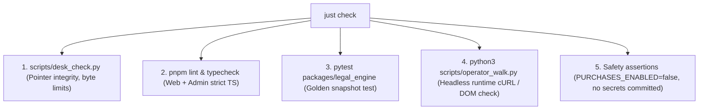

# `evo_02` Agentic Harness & Verification Specification

**Date:** 2026-08-16  
**Purpose:** Technical specification for the agentic harness, desk discipline, automated verification gates, and continuous integrity checks in `evo_02`.

---

## 1. Single Desk Architecture

In `evo_02`, all agents (Claude, Gemini, Grok, Hermes, Cursor) operate on a strictly unified control surface. Sub-packages and applications do NOT have their own `continue.md` or next-action files.

```
evo_02/
├── AGENTS.md                  # Universal laws for ALL agents across all folders
├── CONTINUE.md                # The ONLY live next-action & locked facts file
├── Justfile                   # Single command runner for desk and verification
└── control_center/
    └── sprints/
        └── ACTIVE_SPRINT.md   # Current active engineering tickets (derived from LAST_20)
```

### Invariants:
1. **No Island Continue Files:** If an agent creates a local `continue.md` in `apps/web/`, `packages/`, or `studio/`, `just check` will fail immediately.
2. **Frozen Pointers:** Platform-specific entry files (`CLAUDE.md`, `GEMINI.md`, `.cursorrules`, `.agents/rules/`, `.grok/rules/`) are strictly read-only pointers under 900 bytes that redirect to root `AGENTS.md` and `CONTINUE.md`.
3. **Session Wrap Ritual:** Every agent turn wraps with:
   - Overwriting root `CONTINUE.md`
   - Updating `control_center/sprints/ACTIVE_SPRINT.md`
   - Executing `just check`

---

## 2. Programmatic "Done Means Walked" Gates

Under `evo_02`, agents are forbidden from declaring a task "done", "fixed", or "shipped" based solely on unit tests. Every verification gate must be automated via `just check`.



### The 5 Gates of `just check`:

```bash
# Justfile
check:
    @echo "=== Gate 1: Desk Alignment ==="
    python3 scripts/desk_check.py
    
    @echo "=== Gate 2: Static Types & Lints ==="
    pnpm turbo run lint typecheck
    
    @echo "=== Gate 3: Legal Engine Snapshots ==="
    pytest packages/legal_engine/tests -v
    
    @echo "=== Gate 4: Headless Operator Walk ==="
    python3 scripts/operator_walk.py
    
    @echo "=== Gate 5: Security & Secrets ==="
    python3 scripts/security_gate.py
```

---

## 3. Data Flow & Contract Schema Invariants

To eliminate the "Data Exists in Knowledge, Empty on Screen" problem:

1. **Zod Validation on All Data Boundaries:**
   Every horse record rendered on `/marketplace/[slug]` or `/mystable` must pass strict runtime validation. If a horse is in `listed` status, missing attributes (trainer website, pedigree, race record, pricing) throw a runtime build/SSR error rather than rendering a blank field.

2. **Single Document Compiler (`packages/legal_engine`):**
   - The legal engine compiles canonical PDS and Syndicate Agreements from structured JSON.
   - It outputs both Markdown (for browser reading/preview) and DOCX/PDF (for legal signing).
   - Any modification to clause templates requires updating golden snapshots.

3. **Supabase Database SSOT:**
   - Supabase `inventory` is the single source of truth for stock, rates, and listing status.
   - Local SQLite in Mission Control is an authoring workbench that synchronizes to Supabase via typed API bridges (`@evo/db_models`).

---

## 4. Quarantined Studio Isolation

To protect agent context windows from multi-gigabyte bloat:

- `studio/` contains all non-production operator tooling (Remotion video rendering, scrapers, email draft automations).
- `studio/` dependencies are quarantined in separate lockfiles and ignored by root lint/build chains.
- Runtime applications (`apps/web`, `apps/mission_control`) are strictly forbidden from importing modules from `studio/`.

---

## 5. Agent Anti-Pattern Defense Checklist

Before completing any task, every agent must verify:

- [ ] **No Inline Event Handlers Without Window Bindings:** All event handling uses React / Next.js synthetic events or standard `addEventListener`.
- [ ] **No Hand-Edited Cache Parameters:** Asset versioning is handled automatically by bundlers.
- [ ] **No Raw Database Operations in Test Suites:** Tests run against isolated in-memory databases.
- [ ] **No Secondary Memory Files:** No new `.md` files created in subdirectories to hold session notes.
- [ ] **No Scope Creep:** No v2 tokenization or unapproved feature work started while active sprint items remain open.
