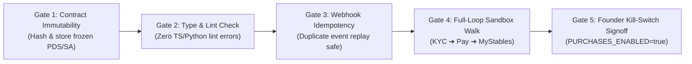

# Evolution Stables: `evo_02` Master Architecture & Migration Plan

**Date:** 2026-08-16  
**Status:** DRAFT FOR AUDIT & APPROVAL  
**Workspace:** `\\wsl.localhost\Ubuntu\home\evo\new\evo_02`  
**Reference Workspaces (Read-Only):** `/home/evo/new/evo_01`, `/home/evo/workspace`

---

## 1. Executive Summary & Core Mission

### The Goal
Build a high-performance, institutional-grade, zero-debt digital racehorse syndication platform for New Zealanders (**Evolution Stables**). The platform enables retail and wholesale investors to discover racehorses, complete regulatory AML/KYC verification, subscribe to Digitally Syndicated Leases (DSLs) via Stripe, and manage their portfolio and race day updates in a real-time investor dashboard (**MyStables**).

### The Strategic Shift: Why `evo_02` (Greenfield) Over In-Place Refactor
`evo_01` accumulated significant operational debt across multiple development eras:
1. **Context & Token Bloat:** Remotion video rendering scripts, TikTok/reels generators, industry scrapers, image deduplication scripts, and multi-agent relay files all lived inside the production web workspace, causing agent hallucinations, slow context indexing, and frequent regressions.
2. **Backend Fragmentation:** Remnants of retired GCP Cloud Functions, Firestore configs, Google Sheets dual-write scaffolding, and local SQLite databases created conflicting sources of truth.
3. **Franken-Auth Risk:** Authentication was split between Firebase Auth (login & KYC custom claims) and Supabase (database & holdings).
4. **Legal Generator Coupling:** Legal doc generators contained deprecated handler methods and lacked automated snapshot regression tests.
5. **The 70-80% Agentic Trap:** Agents verified work solely via unit tests while runtime UI handlers, DOM event bindings, and live queries were broken (see [`EVO01_POSTMORTEM_AND_ANTIPATTERNS.md`](file:///home/evo/new/evo_01/migration/EVO01_POSTMORTEM_AND_ANTIPATTERNS.md) and [`EVO02_AGENTIC_HARNESS_SPEC.md`](file:///home/evo/new/evo_01/migration/EVO02_AGENTIC_HARNESS_SPEC.md)).

**The Decision:** Rather than performing a high-risk in-place surgery on `evo_01` (which could silently break live horse data or create an un-deployable hybrid state), we establish **`evo_02` as a pure, greenfield build**.
* `evo_01` and `workspace` remain untouched as immutable historical references.
* `evo_02` is already scaffolded with its 4 core packages (`legal_engine`, `db_models`, `brand_dna`, `storage`) and initial apps (`mission_control`, `web`), strictly passing `pnpm check` and verified against the locked `DSL_MANUAL.md`.

---

## 2. Target Architecture & The 4-Island Topology

To permanently prevent context bloat, media asset pollution, and architectural drift, the Evolution ecosystem is structured into **4 strictly isolated workspace islands**:

```
┌────────────────────────────────────────────────────────────────────────┐
│  evo_00 — OPERATOR & AGENTIC CONTROL PLANE (Workstation Hub)           │
│                                                                        │
│   • Agent Harnesses: Pi (pi.dev) configs, GSD-2 task runners           │
│   • Context & Memory: gbrain MCP persistent knowledge graph, prompts   │
│   • Background Daemons (Downstream): OpenFang scheduled tasks / alerts │
│   • Master Decision Records: Global ADRs & cross-island desk checks    │
└───────────────────────────────────┬────────────────────────────────────┘
                                    │ Governs & Coordinates
                                    ▼
┌────────────────────────────────────────────────────────────────────────┐
│  evo_02 — PRODUCTION PLATFORM MONOREPO (Pure, Zero-Bloat Application) │
│                                                                        │
│   ├── /packages/                                                       │
│   │   ├── legal_engine (DSL Manual PDS & SA compiler)                │
│   │   ├── brand_dna    (Tokens, Geist typography, Logos)               │
│   │   ├── db_models    (Supabase schemas, types, migrations)           │
│   │   └── storage      (Cloudflare R2 client & pre-signed uploaders)   │
│   └── /apps/                                                           │
│       ├── web             (Next.js 15 Storefront & MyStables)          │
│       └── mission_control (Internal Admin & Horse Ops)                 │
└───────────────────────────────────┬────────────────────────────────────┘
                                    │ Emits Media & Event Data
                                    ▼
┌────────────────────────────────────────────────────────────────────────┐
│  evo_03 — STUDIO & CREATIVE ENGINE (Heavy Media Sandbox)               │
│                                                                        │
│   • Remotion Video Renderers (9:16 TikTok/Reels, Trainer B-roll)       │
│   • Media Pipeline: Pulls raw video from Cloudflare R2 ($0 Egress)     │
│   • Output: Renders finished MP4s and uploads back to R2 CDN           │
└────────────────────────────────────────────────────────────────────────┘

┌────────────────────────────────────────────────────────────────────────┐
│  evo_01 — HISTORICAL ARCHIVE (Read-Only)                               │
│   • Preserved legacy reference — untouched.                            │
└────────────────────────────────────────────────────────────────────────┘
```

### Directory Roles & Responsibilities inside `evo_02`

| Compartment | Path | Purpose | Invariant Rule |
| :--- | :--- | :--- | :--- |
| **Legal Engine** | `/packages/legal_engine/` | Standalone PDS and Syndicate Agreement compiler based on the DSL Manual. | 100% snapshot tested. Zero web UI dependencies. |
| **Brand DNA** | `/packages/brand_dna/` | Design system tokens, color definitions, Geist Sans fonts, SVGs. | Token-based. Zero inline arbitrary hex colors in apps. |
| **Database Models** | `/packages/db_models/` | Supabase schemas, SQL migrations, generated TypeScript/Python types. | Single SSOT for all database structures and RLS policies. |
| **Storage Engine** | `/packages/storage/` | Cloudflare R2 client, pre-signed upload helpers, CDN URL generators. | Lightweight `@aws-sdk/client-s3` wrapper. |
| **Web Application** | `/apps/web/` | Next.js 15 storefront, investor onboarding, Stripe checkout, MyStables. | Consumes `@evo/*` packages. Pure Supabase Auth. |
| **Mission Control** | `/apps/mission_control/` | Admin back-office for horse creation, pack compilation, listing management. | Directly bridges to Supabase & Cloudflare R2. |

---

## 3. The 4 Governing Constitutions (Immutable Business Logic)

### Pillar I: Commercial & Legal Rules (The DSL Manual)
* **Pricing Formula:**
  $$\text{list} = \text{cost} \times 1.05 \times 1.03 \quad \text{(round UP to whole NZD)}$$
  $$\text{M} = \text{list} \times \text{stake}\% \quad \text{(round UP to whole NZD)}$$
  * +5% Evolution margin + 3% payment processing buffer are baked into the rate.
* **Payment Model:**
  * Default: `subscription_float` — Investor pays **$5\times\text{M}$** on Day 1 (3 months security deposit + 2 months prepaid), followed by $\text{M}$ monthly to maintain a float of 5.
* **Syndicate Close Trigger:**
  * **Standard:** 14-day notice when the underlying lessor lease ends (Case B).
  * **Optional (per DSL):** 3× buyout of remaining lease value where head lease provides exit proceeds (Case B1). Configured via DSL field pack `close_style`.
* **Prize Money & Welfare:**
  * **Gross Stakes Distribution:** 75% Investor Distribution Pool / 25% Owner Retention. The 25% is retained by the horse owner/lessor to absorb all NZTR source deductions (~15–18%), jockey/trainer cuts, race nominations, and acceptances — shielding investors from any subsequent capital calls. Evolution Stables does **not** take or hold this 25%.
  * SA Clause 6: Trainer/Racing Manager has final authority on horse welfare and training decisions.
  * Tokinvest terminology is completely stripped. Each DSL is a fixed-term digital leasehold.

### Pillar II: Brand Voice & UI Design System
* **Aesthetics:** Regulated, institutional, understated luxury thoroughbred syndication.
* **Palette:**
  * Canvas: `#030303` (Background)
  * Surface: `#0a0a0a` (Cards/Panels)
  * Raised: `#111111` (Elevated fields/Inputs)
  * Accent: `#d4a964` (Sole gold accent for active CTAs and highlights)
* **Depth & Elevation:** Tonal layering and 1px hairline borders (`rgba(255,255,255,0.1)`). No drop shadows, no colorful gradients.
* **Typography:** Geist Sans with tight tracking (`-0.02em`) and 1.7 line height for body text.

### Pillar III: Data & State Architecture
* **Single Database SSOT:** Supabase `Evolution-3.0` (`coqtijrftaklcwgbnqef`).
* **Core Tables:** `inventory`, `holdings`, `leads`, `events`, `communications`.
* **6-State Campaign Lifecycle:** `draft` $\rightarrow$ `coming_soon` $\rightarrow$ `coming_soon_details` $\rightarrow$ `listed` $\rightarrow$ `fully_subscribed` $\rightarrow$ `completed`.
* **Auth:** Pure Supabase Auth (replacing the split Firebase Auth configuration).

### Pillar IV: Desk Laws & Development Discipline
* **One Desk:** Root `AGENTS.md` and `CONTINUE.md` only. No island continue files.
* **Verification Invariant:** "Done means walked". Automated test passing is required, plus visual or cURL verification.
* **Kill Switch:** `PURCHASES_ENABLED` must be strictly `"false"` until full end-to-end sandbox sign-off.

---

## 4. Step-by-Step Migration Execution Plan

```
[Phase 1: Control Center] ──► [Phase 2: Core Packages] ──► [Phase 3: Legal Hardening]
       ──► [Phase 4: Web Engine Rewrite] ──► [Phase 5: E2E Verification & Launch Gate]
```

### Phase 1: Establish the Control Center (`/control_center/`)
1. Create `control_center/decisions/ADR_INDEX.md` and populate fundamental decisions (e.g., DSL Manual, Supabase SSOT, Pure Supabase Auth, DSL nomenclature).
2. Create `control_center/roadmap/ROADMAP.md` and `PARKED_IDEAS.md` (capturing deferred TikTok, secondary marketplace, and podcast update concepts).
3. Create `control_center/sprints/ACTIVE_SPRINT.md` (migrating open items from `docs/LAST_20.md`).
4. Create `control_center/comms_ledger/COMMS_LEDGER.md` (registering sent updates).

### Phase 2: Core Shared Packages (`/packages/`)
1. **`brand_dna`**: Port design tokens, Geist Sans fonts, SVGs, and Tailwind configuration directly from `_shared/dna` and `02_website/DESIGN.md`.
2. **`db_models`**: Establish Supabase TypeScript types, SQL migration schemas, and RLS policies for `inventory`, `holdings`, `leads`, `events`, `content_assets`.
3. **`storage`**: Build `@evo/storage` shared package with S3-compatible Cloudflare R2 client, pre-signed upload helpers, and CDN URL formatting.
4. **Horse Knowledge SSOT**: Migrate canonical horse records for **Nellie** (Lady Ketchikan) and **TML** (Mulan) into clean JSON/Markdown format.

### Phase 3: Hardened Legal Engine (`/packages/legal_engine/`)
1. Migrate `pack_lib.py` logic into a pure, modular Python/TypeScript compiler.
2. Prune all dead legacy UI handler methods (`_serve_file`, `_handle_approve`).
3. Implement **Golden Snapshot Testing**: Automatically generate PDS and SA files for Nellie and TML and verify 100% word-for-word accuracy against the DSL Manual.

### Phase 4: Clean-Room Web Engine (`/apps/web/`)
**ADR-004: Clean-Room Rebuild over Legacy Route Migration**  
*Context:* Legacy prototypes (`evo_01` / `02_website`) contained tangled Firebase Admin auth, Google Sheets sync, and hardcoded pricing logic. Copying legacy routes directly imports debt.  
*Decision:* We strictly audit legacy assets (design, copy, typography, media) and **rebuild the UI shells from scratch**, decoupling presentation from data wiring.

1. **Sub-Phase 4A: Visual Foundation & Public Storefront Shell**
   * Next.js 15 App Router with `@evo/brand_dna` dark luxury institutional design system.
   * Semantic SEO structure (JSON-LD, OpenGraph, dynamic sitemaps).
   * Public Homepage (`/`) and Thoroughbred PDP Shell (`/horses/[slug]`):
     - **Hard Layer (Fact):** Dynamic pricing from `@evo/legal_engine`, 4-way cap table balancer, frozen PDS/SA download links.
     - **Soft Layer (Story):** Conformation media, trainer yard bio, pedigree bloodlines, and **Thoroughbred Attributes** profile.
     - Presentation-only: Unwired to live checkout to isolate visual approval.
2. **Sub-Phase 4B: Pure Supabase Auth & Investor Profile**
   * PKCE SSR cookie-based authentication via `@supabase/ssr` (`/login`, `/auth/callback`).
   * Zero Firebase dependencies.
3. **Sub-Phase 4C: Stripe Concurrency Checkout & MyStable Portal**
   * Checkout triggers atomic PostgreSQL RPC `reserve_campaign_shares` (15-min TTL lock).
   * Idempotent Stripe webhook pipeline (`checkout.session.completed`) logging to `events`.
   * `/mystable` investor portfolio dashboard showing active leaseholds, certificates, and prize payouts.

### Phase 5: Quarantined Studio Setup (`/studio/`)
1. Move `06_content-pipeline` (Remotion) into `studio/video/`.
2. Move `04_comms` into `studio/comms/`.
3. Move `05_industry-data` into `studio/racing_data/`.
4. Mark all studio modules as deferred in `control_center/roadmap/PARKED_IDEAS.md`.

---

## 5. Logic, Invariants & Safety Verification Protocols

To guarantee zero customer trust failures, the following **5 Safety Gates** must be satisfied before launch:



### Safety Check 1: Immutable Contract Snapshots
* When a horse is listed, its PDS and SA are compiled, cryptographically hashed (SHA-256), and stored as static PDFs/DOCXs in permanent storage.
* The web app serves the immutable file URL. It **never dynamically generates live contracts for active shareholders**.

### Safety Check 2: Stripe Webhook Idempotency & Resiliency
* Webhooks store `stripe_event_id` in Supabase `events` table with a unique constraint.
* If Stripe replays a webhook event, the handler acknowledges with `200 OK` without duplicating investor holdings or share counts.

### Safety Check 3: Fail-Closed Commercial Boundaries
* If `PURCHASES_ENABLED !== "true"`, checkout routes abort immediately with HTTP 403.
* If a horse is not in `listed` status or has 0 shares remaining, the checkout session rejects.

### Safety Check 4: The 5-Minute Investor Sandbox Audit
Before flipping live money:
1. Load `/marketplace/nellie`. Verify hero images, pedigree, trainer bio, and commercial numbers ($76/mo per 1%).
2. Open PDS and SA preview. Verify 5% Evolution fee, 3% buffer, **close style per DSL** (14-day notice **or** 3× buyout where head lease provides exit proceeds), NZTR COP 22.1 terms.
3. Complete Stripe Identity KYC verification in sandbox.
4. Execute test credit card payment for $380 (5× $76 for 1%).
5. Verify webhook logs: `200 OK`, holding created in Supabase.
6. Open `/mystable`. Verify Nellie appears with 1% share, active leasehold status, and downloadable contract.

### Safety Check 5: Continuous Desk Health (`just check`)
A single command at root:
```bash
just check
```
Verifies:
* TypeScript strict compilation on `apps/web`.
* Legal engine golden snapshot tests pass.
* No unauthorized files or uncommitted `.env` files.
* Control Center active sprint alignment.

---

## 6. Audit & Sign-Off Checklist

- [ ] **Architecture Boundaries Approved:** Physical separation of Control Center, Packages, Apps, and Studio.
- [ ] **Migration Sequence Approved:** Phased migration from Control Center through Web and Studio.
- [ ] **Commercial Constitutions Confirmed:** 5×M float, **14-day close (standard) / 3× buyout (per DSL where head lease provides exit proceeds)**, 75/25 prize split, Tokinvest eliminated.
- [ ] **Brand DNA Confirmed:** Dark institutional palette, Geist Sans typography, hairline borders.
- [ ] **Safety Protocols Approved:** Immutable contract snapshots, webhook idempotency, fail-closed guards.

---

## 7. Tooling & Engineering Standards (The 5 Golden Requirements)

```
┌─────────────────────────┬───────────────────────────────────┬──────────────────────────────────────────┐
│ Subsystem               │ evo_01 Legacy Debt                │ evo_02 Locked Engineering Standard       │
├─────────────────────────┼───────────────────────────────────┼──────────────────────────────────────────┤
│ 1. DB Migrations & Types│ Split SQLite + Sheets + Supabase  │ Supabase CLI SQL migrations + auto TS    │
│                         │ Hand-edited TS types drifting     │ pnpm db:typegen > database.ts            │
├─────────────────────────┼───────────────────────────────────┼──────────────────────────────────────────┤
│ 2. Monorepo Build       │ Nested 02_website/.git repo       │ Turborepo (turbo.json) + Vercel transpile│
│                         │ Broken relative imports in Vercel │ transpilePackages: ['@evo/*']            │
├─────────────────────────┼───────────────────────────────────┼──────────────────────────────────────────┤
│ 3. Env Validation       │ Silent runtime undefined          │ Zod-enforced @t3-oss/env-nextjs schema   │
│                         │ Missing secrets in prod           │ Fails build/boot if secrets missing      │
├─────────────────────────┼───────────────────────────────────┼──────────────────────────────────────────┤
│ 4. Stripe Webhooks      │ Live dashboard clicking required  │ just stripe-listen local tunnel          │
│                         │ Unverified float allocations      │ Offline JSON fixture replay in tests     │
├─────────────────────────┼───────────────────────────────────┼──────────────────────────────────────────┤
│ 5. Python Management    │ Multi-GB .venv in repo            │ uv workspaces + pyproject.toml           │
│                         │ sys.path.append hacks             │ Sub-second resolution, no git venv bloat │
└─────────────────────────┴───────────────────────────────────┴──────────────────────────────────────────┘
```

### Detailed Implementation Specifications:
1. **Supabase Migrations & Typegen:**
   * Versioned migrations live in `packages/db_models/supabase/migrations/`.
   * Typegen script: `pnpm db:typegen` runs `supabase gen types typescript --local > packages/db_models/src/types/database.ts`.
   * `just check` asserts generated types match active migrations.
2. **Vercel Monorepo Deployment:**
   * `apps/web/next.config.mjs` explicitly sets `transpilePackages: ['@evo/brand_dna', '@evo/db_models', '@evo/legal_engine']`.
   * Vercel project configured with Root Directory = `apps/web` and `npx turbo-ignore` build caching.
3. **Zod Environment Validator:**
   * Unified Zod schema at `packages/db_models/src/env.ts` (or `@t3-oss/env-nextjs`).
   * Boot and build fail immediately if required secrets (`NEXT_PUBLIC_SUPABASE_URL`, `SUPABASE_SERVICE_ROLE_KEY`, `STRIPE_SECRET_KEY`, `STRIPE_WEBHOOK_SECRET`) are missing.
   * `PURCHASES_ENABLED` defaults strictly to `false` in code.
4. **Local Stripe Sandbox Runner:**
   * Command added to Justfile: `just stripe-listen` (`stripe listen --forward-to localhost:3000/api/webhooks/stripe`).
   * `scripts/operator_walk.py` includes offline mock JSON webhook fixtures to test holding allocation and idempotency.
5. **Python Tooling via `uv`:**
   * All Python packages (`packages/legal_engine`, Mission Control backend, verification scripts) managed via `uv`.
   * Virtualenvs stored outside Git tracking; standard workspace root in `pyproject.toml`.

---

## 8. The 6 End-to-End Operational Bridges

```
[1. INTAKE / MC] ──► [2. LEGAL / SSOT] ──► [3. STOREFRONT & KYC] ──► [4. CHECKOUT & FLOAT] ──► [5. MYSTABLES] ──► [6. COMMS & UPDATES]
      │                     │                     │                        │                     │                     │
 Wholesale Lease       Compiled PDS/SA       Live Marketplace         Stripe $5×M Float     Investor Dashboard    Automated Triggers
  (Trainer/Lessor)     SHA-256 Snapshots    + Stripe Identity         & Holding Created      & Contract Vault     (Race Alerts, Ledger)
```

### 1. The Lean Comms Division: Stripe Native vs. Resend
To maximize reliability and eliminate custom code, communication is split between native platform tools and bespoke transactional delivery:

* **Stripe Native (Zero Code / Built-in):**
  * Automated payment receipts for initial $5×M checkout and recurring monthly $M charges.
  * Automated failed payment & dunning notices (with 1-click update-card links).
  * Upcoming subscription renewal reminders and card expiry alerts.
  * Pre-authenticated Customer Billing Portal (self-service card updating in MyStables).
* **Resend (Bespoke Product & Legal Comms):**
  * Welcome email + Magic Login links (Supabase Auth).
  * **Syndicate Welcome Pack:** Holding confirmation + downloadable signed PDS & Syndicate Agreement PDF attachments.
  * Post-launch trainer audio memos and quarterly prize distribution statements.

### 2. The 1-Click Trainer Update ➔ Investor Feed Bridge
* Mission Control includes a streamlined "Post Horse Update" module.
* Operator uploads trainer voice notes, video clips, or trackwork notes and tags the horse.
* **1-Click Broadcast:** Instantly publishes to the `/mystable` timeline for holders of that horse and triggers email/push notifications.

### 3. Stripe Customer Billing Portal in `/mystable`
* A native "Manage Payment Method" button in `/mystable` deep-links to a pre-authenticated Stripe Billing Portal session.
* Investors can update credit cards or view raw Stripe tax invoices self-service, eliminating accidental defaults from expired cards.

### 4. The Legal Execution Vault (`holdings` Table Audit Trail)
* To satisfy NZTR COP 22.1 and legal auditability, every checkout stores an immutable record:
  ```json
  {
    "investor_id": "usr_123",
    "horse_id": "lady-ketchikan",
    "stake_pct": 1.0,
    "pds_hash": "sha256_e3b0c44...",
    "sa_hash": "sha256_8f4a12...",
    "accepted_terms_at": "2026-08-16T07:28:00Z",
    "ip_address": "202.89.x.x",
    "stripe_subscription_id": "sub_987"
  }
  ```
* In `/mystable`, the investor has a permanent "Legal Documents" tab to download their exact, time-stamped contract files.

### 5. NZTR / Loveracing Result Placement (Two-Phase Strategy)
* **Phase 1 (GTM & Investor Checkout Focus):**
  * Core statistics fields (`career_starts`, `career_wins`, `career_seconds`, `career_thirds`, `gross_stakes_nzd`, `loveracing_url`) are established in the Supabase `inventory` schema from Day 1.
  * Verified and confirmed manually via Mission Control intake at listing creation.
* **Phase 2 (Post-Launch Automation):**
  * A lightweight weekly scheduled cron (`studio/racing_data/sync_results.py`) reads the stored `loveracing_url` and automatically refreshes race results and prize distribution pools without blocking checkout workflows.

### 6. The "Coming Soon" ➔ VIP Waitlist Pipeline
* When a horse is in `coming_soon` or `coming_soon_details` status, the marketplace displays a "Join VIP Priority List" CTA.
* Submits lead to the Supabase `leads` table with the horse tag.
* When the syndicate moves to `listed` status, a 1-click broadcast notifies waitlisted leads 24 hours before public release.

---

## 9. The Hybrid Media & Cloud Storage Architecture

To achieve zero video bandwidth bills, sub-30ms global media delivery, and strict regulatory contract security, storage is split into two distinct tiers:

```
┌──────────────────────────────────────────────┐
│ 1. SUPABASE STORAGE (Regulatory & Legal Vault)│
│                                              │
│ • Hashed PDS & Syndicate Agreements (PDF)    │
│ • Investor KYC Verification Snapshots        │
│ • Official Lease Certificates                │
│                                              │
│ ➜ Security: Protected by Supabase Auth & RLS │
│ ➜ Capacity: Tiny footprint (<100MB / 1GB free│
└──────────────────────────────────────────────┘
                       ▲
                       │ Indexed in Supabase DB (`content_assets`)
                       ▼
┌──────────────────────────────────────────────┐
│ 2. CLOUDFLARE R2 (Heavy Media & Content Hub) │
│                                              │
│ • Trainer WhatsApp Videos & Trackwork (MP4)  │
│ • High-Res Horse & Conformation Photos (JPG) │
│ • Trainer, Owner & Jockey Headshots / Silks  │
│ • Remotion Raw Assets & Finished Reels       │
│                                              │
│ ➜ Cost: $0 Egress / Zero Bandwidth Fees      │
│ ➜ Delivery: Blazing sub-30ms Global Edge CDN │
│ ➜ Domain: `cdn.evolutionstables.nz`          │
└──────────────────────────────────────────────┘
```

### 9.1 Multi-Entity Media Taxonomy in Cloudflare R2

All binary media is organized into a clean entity hierarchy:

```
evolution-media/ (Cloudflare R2 Bucket)
├── /horses/
│   ├── /lady-ketchikan/
│   │   ├── /hero/            (Official studio photography, conformation)
│   │   └── /updates/         (Trackwork videos, voice memos, race day clips)
│   └── /tml-x-yearn/
├── /trainers/
│   ├── /stephen-marsh/       (Bio portrait, Cambridge stable B-roll, audio intro)
│   └── /kylie-bax/           (Bio photo, interview clips, farm footage)
├── /owners/
│   ├── /bax-bloodstock/      (Owner bio, stable crest/logo, silks imagery)
│   └── /sgr/
├── /jockeys/
│   └── /craig-grylls/        (Jockey portrait, career highlights)
└── /marketing/
    └── /reels/               (Finished 9:16 video renders from evo_03 Studio)
```

### 9.2 Shared Storage Package (`packages/storage/`)

A single, shared library (`@evo/storage`) provides S3-compatible client access across `apps/web`, `apps/mission_control`, and `evo_03` Studio:

* **Uploads:** Handled server-side or via generated pre-signed URLs using `@aws-sdk/client-s3`.
* **Client Retrieval:** End-users stream photos and videos directly from Cloudflare's edge CDN (`https://cdn.evolutionstables.nz/...`) with zero SDK overhead and sub-30ms latency.
* **Studio Integration (`evo_03`):** Remotion fetches raw footage directly from Cloudflare CDN URLs ($0 bandwidth egress), renders branded social reels, and uploads finished MP4s back to `/marketing/reels/`.


